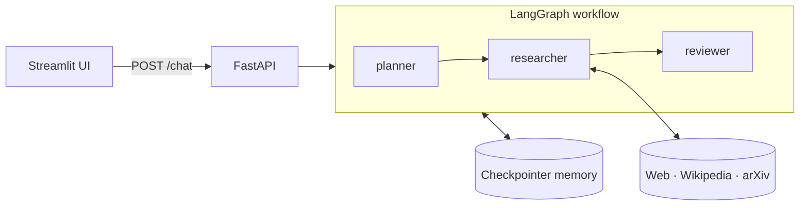

# 🔎 Research Assistant

An agentic research assistant that **plans** its research, **uses tools** (web, Wikipedia, arXiv) to gather evidence, then **reflects** on its own draft and rewrites it before answering. Conversations have **memory**, so follow-up questions like *"who are its authors?"* just work.

Built with **LangGraph**, **LangChain**, **FastAPI** and **Streamlit**.

## Features

| Agentic pattern | How it is implemented |
|---|---|
| **Planning** | A planner node turns the question (plus chat history) into 2–4 research steps using structured output. |
| **Tool use** | A tool-calling agent follows the plan with DuckDuckGo web search, Wikipedia and arXiv. |
| **Reflection** | A reviewer node writes a report (strengths, limitations, suggestions) on the draft and produces a revised answer. |
| **Memory** | A LangGraph checkpointer stores each conversation by `thread_id`. |

Robustness:
- Tool failures are returned to the model as messages instead of crashing the request, so it can fall back to another source.
- Tool calls are capped per request; once the cap is hit the model answers with what it has.

## Architecture



1. **planner** reads the conversation and produces a short research plan.
2. **researcher** is a tool-calling agent that executes the plan and writes a draft answer with sources.
3. **reviewer** critiques the draft and returns a revised final answer.

The UI shows the plan, the draft, the reflection report and the revised answer for every question.

## Tech stack

- **LangGraph**: stateful workflow and conversation memory (checkpointer)
- **LangChain**: tool-calling agent, middleware, tools
- **FastAPI**: REST backend
- **Streamlit**: chat UI
- **LLM**: any OpenAI-compatible endpoint (default: `deepseek-v4-flash`)

## Getting started

```bash
git clone https://github.com/<your-username>/research-assistant.git
cd research-assistant
python -m venv .venv
.venv\Scripts\activate          # macOS/Linux: source .venv/bin/activate
pip install -r requirements.txt
```

Copy `.env.example` to `.env` and set your API key:

```env
OPENAI_API_KEY=your-api-key-here
OPENAI_BASE_URL=https://api.gapgpt.app/v1
```

Run the backend and the UI in two terminals:

```bash
uvicorn main:app --reload --port 8000
streamlit run app.py --server.port 8501
```

Open http://localhost:8501. Interactive API docs are at http://localhost:8000/docs.

## API

`POST /chat`

```json
{ "query": "What is the Reflexion paper about?", "thread_id": "any-unique-id" }
```

Response:

```json
{
  "plan": ["..."],
  "draft": "answer before reflection",
  "critique": "reflection report",
  "answer": "revised final answer"
}
```

Reuse the same `thread_id` to continue a conversation.

## Project structure

```
├── agent_lo.py       # LangGraph workflow: planner → researcher → reviewer, tools, memory
├── main.py           # FastAPI backend
├── app.py            # Streamlit chat UI
├── requirements.txt
└── .env.example
```

## Roadmap

- Persistent memory (SQLite/Postgres checkpointer)
- Streaming responses
- RAG over private documents as an extra tool
