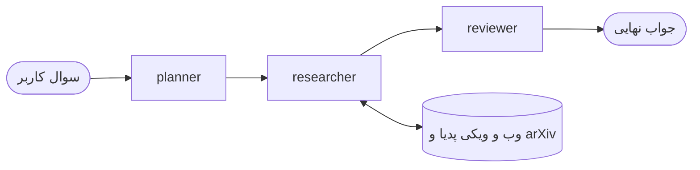

# دستیار تحقیق

یک پروژه آموزشی برای یادگیری و پیاده سازی الگوهای اصلی Agentic AI با LangGraph

این دستیار به سوال های تحقیقاتی جواب میدهد و قبل از جواب دادن برنامه ریزی میکند و در منابع مختلف جستجو میکند و در آخر جواب خودش را نقد و بازنویسی میکند

## الگوهای پیاده سازی شده

### برنامه ریزی (Planning)

- نود planner سوال کاربر و تاریخچه گفتگو را میخواند و یک برنامه تحقیق دو تا چهار مرحله ای میسازد
- خروجی با Structured Output و یک مدل Pydantic گرفته میشود تا همیشه یک لیست مرتب از مراحل باشد
- هر مرحله مشخص میکند برای آن بخش از کدام منبع استفاده شود

### استفاده از ابزار (Tool Use)

- نود researcher یک Agent با قابلیت Tool Calling است که با `create_agent` ساخته شده
- سه ابزار دارد: جستجوی وب با DuckDuckGo و ویکی پدیا و مقالات arXiv
- برنامه تحقیق در System Prompt به Agent داده میشود و خود Agent تصمیم میگیرد کدام ابزار را چند بار صدا بزند
- در جواب مشخص میکند هر اطلاعات از کدام منبع آمده

### بازتاب (Reflection)

- نود reviewer پیش نویس جواب را مثل یک داور سختگیر بررسی میکند
- یک گزارش سه بخشی مینویسد: نقاط قوت و محدودیت ها و پیشنهادها
- بر اساس همین گزارش نسخه اصلاح شده جواب را تولید میکند
- گزارش و جواب نهایی هر دو در یک فراخوانی مدل و به صورت Structured Output گرفته میشوند
- در رابط کاربری پیش نویس و گزارش Reflection و جواب نهایی جدا از هم نمایش داده میشوند تا اثر Reflection دیده شود

### حافظه (Memory)

- هر گفتگو یک `thread_id` دارد و LangGraph با Checkpointer وضعیت هر گفتگو را جدا نگه میدارد
- برای همین سوال های ادامه دار مثل «نویسنده هایش چه کسانی هستند» درست فهمیده میشوند
- دکمه New chat یک گفتگوی تازه با حافظه خالی شروع میکند
- حافظه فعلا در RAM است (`InMemorySaver`) و با ری استارت سرور پاک میشود

## ساختار گراف در LangGraph



- State شامل پیام های گفتگو (`MessagesState`) به اضافه `plan` و `draft` و `critique` است
- سه نود planner و researcher و reviewer پشت سر هم اجرا میشوند
- نود researcher خودش یک Agent کامل است که داخل گراف اصلی اجرا میشود
- فقط سوال کاربر و جواب نهایی در حافظه ذخیره میشوند و پیام های داخلی ابزارها وارد تاریخچه نمیشوند تا تاریخچه تمیز بماند

## مقاوم سازی

- اگر یکی از ابزارها خطا بدهد خطا به صورت پیام به مدل برمیگردد تا با ابزار دیگری ادامه دهد (Middleware با `wrap_tool_call`)
- تعداد فراخوانی ابزارها در هر سوال محدود است (`ToolCallLimitMiddleware`) و بعد از آن مدل با اطلاعاتی که جمع کرده جواب میدهد
- ویکی پدیا درخواست هایی را که User-Agent پیش فرض کتابخانه wikipedia را دارند محدود میکند برای همین یک User-Agent اختصاصی تنظیم شده

## نکات آموزشی

- وقتی خروجی ابزارها خیلی کوتاه بود مدل مدام دوباره جستجو میکرد و به سقف مراحل گراف میرسید و با بیشتر کردن متن خروجی ابزارها تعداد مراحل از بیشتر از پانزده به شش رسید
- Reflection کیفیت جواب را بالا میبرد ولی برای هر سوال یک فراخوانی اضافه مدل هزینه دارد
- جدا بودن بک اند (FastAPI) از رابط کاربری (Streamlit) باعث میشود هر فرانت دیگری هم بتواند از همین API استفاده کند

## معماری

- رابط کاربری Streamlit سوال را همراه `thread_id` به اندپوینت `/chat` در FastAPI میفرستد
- FastAPI گراف LangGraph را اجرا میکند و برنامه و پیش نویس و گزارش Reflection و جواب نهایی را برمیگرداند
- مدل زبانی DeepSeek است که از طریق یک API سازگار با OpenAI صدا زده میشود

## اجرا

```bash
pip install -r requirements.txt
```

فایل `.env.example` را به `.env` کپی کنید و کلید API را در آن بگذارید و بعد بک اند و رابط کاربری را در دو ترمینال جدا اجرا کنید

```bash
uvicorn main:app --port 8000
```

```bash
streamlit run app.py
```

## تکنولوژی ها

LangGraph و LangChain و FastAPI و Streamlit و Pydantic
